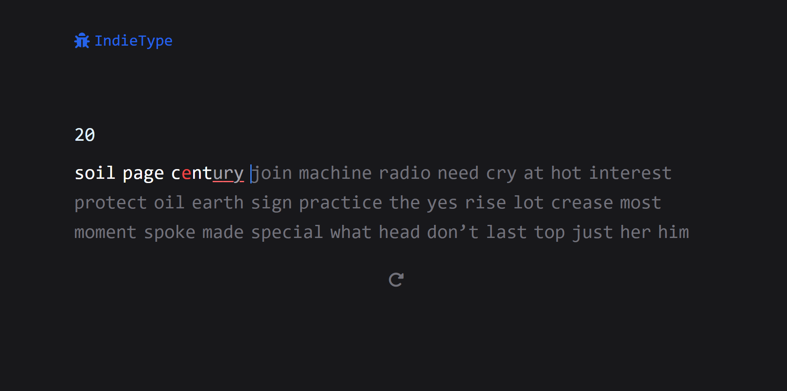

# 🇮🇳 IndieType

**IndieType** is a fun and fast-paced typing speed test platform where users can practice typing in Indian languages (like Hindi, Marathi, Bengali — in Latin script) as well as Gen Z flavors like Weeb-speak and Brainrot. Built for multilingual internet users who want to type fast *and* chaotically.


## 📸 Demo

  


## 🛠️ Tech Stack

- **Frontend:** [React](https://reactjs.org/), [TailwindCSS](https://tailwindcss.com/)


## 📦 Installation

```bash
# Clone the repository
git clone https://github.com/stvy2346/indietype.git
cd brainrot-convertor

# Install frontend dependencies
npm install

# Switch folder
cd typing-app

# Start the development server
npm run dev
```

## 🌐 Live
🚀[Check out the live version here](https://indietype.netlify.app/)
